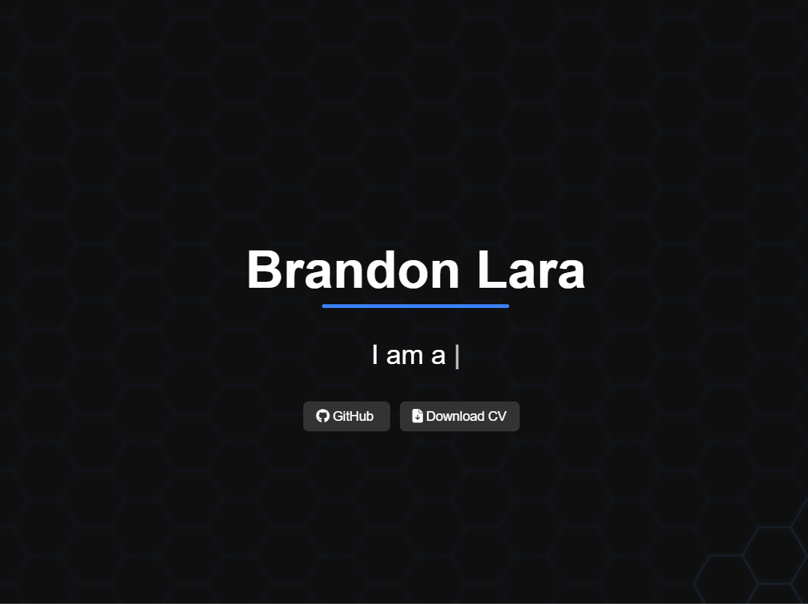

## Hi, I'm Brandon 👋

💻 Fullstack Developer
📱  Mobile Developer
🌱 I’m learning Springboot  
🎸 Passionate about **development** and **music** —  
💬 Feel free to [ask me about both on LinkedIn](https://www.linkedin.com/in/brandonlr/)
📫 Reach me: brandoneck@live.com.mx

---

### 💼 Portfolio

[https://brandoneck.github.io/](https://brandoneck.github.io/)

---

### 🚀 My Featured Projects

- 📱 [Mobile Weather App](https://github.com/brandoneck/weatherApp)  
  Optimized mobile React Native interface for easy UX.

- 🏥 [Hospital Project](https://github.com/brandoneck/hospital)
  A React + Redux Toolkit based video editing interface.

- 📄 [Invoice Format Converter (AI)](https://github.com/brandoneck/facturasAI)
  A Python + Gemini API formater to JSON.

---

## 🧱 Tech Stack

### 🖥️ Frontend
- React.js
- React Native
- Next.js
- Redux Toolkit (for global state management)
- React Context API (`useContext`)
- React Router
- CSS Modules / TailwindCSS / Styled Components

### 🛠️ Backend
- Node.js
- Express.js
- MongoDB with Mongoose
- Nest.js

### 🧪 Testing
- Jest

### ⚙️ Tooling & Dev
- Axios
- ESLint & Prettier
- dotenv (environment variables)
- nodemon *(for standalone Node projects)*
- Git & GitHub
- Postman (for API testing)

